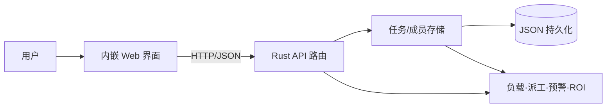

# Moonlight 企业研发团队协作台——课程实践报告

> 提交前请将文中【待填】替换为真实信息，并附上小组的真实截图、会议或任务记录。

## 1. 项目概述

Moonlight 是面向企业研发团队的轻量级内部管理工具。系统将待办、进行中、待评审和已完成任务放入可视化看板，结合成员技能、每周容量、小时成本、任务工时、优先级、截止日期和业务价值，完成负载分析、智能派工、风险预警与经济性分析。

项目的核心业务逻辑、存储和 HTTP 服务由 Rust 实现，用户通过内嵌的 Web 单页界面交互。编译后只需一个二进制文件，适合中小型团队内网演示和低成本部署。

## 2. 需求与功能

| 需求 | 实现 |
| --- | --- |
| 任务全生命周期管理 | 任务创建、删除、分配与四阶段状态流转 |
| 团队资源管理 | 成员角色、周容量、小时成本和实时负载率 |
| 跨学科协作 | 前端、后端、测试、产品、运维角色，支持跨技能支援并给出风险提示 |
| 智能派工 | 技能匹配、接单后容量与人力成本的多准则决策 |
| 风险管理 | 逾期、临期未开工、P0 未派工、过载、跨技能和闲置预警 |
| 经济决策 | 任务人力成本、业务价值、候选人 ROI 和项目组合 ROI |

## 3. 系统环境与开发工具

### 3.1 开发与运行环境

| 项目 | 本次验证环境 | 用途 |
| --- | --- | --- |
| 操作系统 | macOS Darwin 25.5.0 arm64 | 开发、编译与测试 |
| Rust | rustc 1.98.0 | 领域模型、算法、存储、HTTP 服务 |
| Cargo | cargo 1.98.0 | 依赖、构建、测试与代码质量检查 |
| Git | 2.50.1 | 版本管理与小组协作 |
| 浏览器 | Chrome/Chromium 或 Safari 现代版本 | 交互界面和端到端验证 |

实际提交时，各成员应补充自己使用的 Windows/macOS/Linux、VS Code/IDEA/RustRover 及其扩展。

### 3.2 工程化命令

```bash
cargo fmt --check
cargo clippy --all-targets -- -D warnings
cargo test
cargo build --release
cargo run --release
```

这些命令分别对应格式统一、静态分析、自动化测试、优化构建和本地运行，体现对开发工具链的完整使用。

## 4. 系统设计



- `model.rs`：成员、角色、任务、优先级和状态等领域模型。
- `store.rs`：数据加载、修改、安全落盘与旧数据兼容。
- `insight.rs`：负载、候选人评分、自动派工、风险和经济性算法。
- `api.rs` / `http.rs`：HTTP 请求、路由、输入校验和安全限制。
- `web/index.html`：看板、表单、预警、经济指标和响应式交互。

## 5. 多学科团队协作

### 5.1 成员与职责

| 真实姓名 | 学科/特长 | 项目角色 | 负责内容 | 可核验产出 |
| --- | --- | --- | --- | --- |
| 【待填1】 | 【待填】 | 项目负责人/Rust 核心 | 【待填】 | 【提交、文件或截图】 |
| 【待填2】 | 【待填】 | 前端与交互 | 【待填】 | 【提交、文件或截图】 |
| 【待填3】 | 【待填】 | 测试与质量 | 【待填】 | 【提交、文件或截图】 |
| 【待填4，若有】 | 【待填】 | 产品与文档 | 【待填】 | 【提交、文件或截图】 |

### 5.2 协作方法

1. 用户需求由产品角色拆分为领域模型、核心算法、界面和测试任务。
2. 使用 Git 分支和 Pull Request 进行代码评审，每项工作保留可核验记录。
3. 开发人员先自测，测试角色再按验收标准执行功能与异常输入验证。
4. 任务状态在看板中流转，每次评审记录风险、负责人和完成时间。

> 上述方法必须与小组真实过程一致；不应为了报告而虚构协作记录。

## 6. 工程管理原理的应用

- **Kanban 可视化**：四阶段看板表示流程，减少任务状态不透明。
- **WBS 与工时估算**：需求拆分为任务，使用预估工时作为计划基础。
- **优先级和进度管理**：P0/P1/P2 与截止日期共同决定派工顺序。
- **资源平衡**：对每位成员统计 `未完成工时 / 周容量`，将过载阈值设为 100%。
- **风险管理**：通过识别、分级、预警和处置建议形成闭环。
- **量化评价**：健康度由按时率40%、负载均衡35%、派工覆盖25%加权得出。

## 7. 经济决策方法

### 7.1 成本与收益模型

1. 技能匹配时，预计人力成本为：

   `C = 预估工时 × 候选人小时成本`

2. 跨技能支援的生产率系数设为 0.65，考虑学习和沟通成本：

   `C_cross = 预估工时 / 0.65 × 候选人小时成本`

3. 投资回报率：

   `ROI = (预期业务价值 - 预计人力成本) / 预计人力成本`

### 7.2 多准则派工决策

候选人总分为：

`Score = 45% × 技能匹配度 + 30% × 剩余容量得分 + 25% × 经济性得分`

经济性得分使用“最低候选成本 / 当前候选人成本”归一化。模型没有单纯选择便宜的成员，而是在专业能力、可交付性和成本之间折中。权重是当前 MVP 的管理假设，后续应结合历史项目数据校准，而不应宣称为普遍最优解。

### 7.3 技术方案的经济比较

| 方案 | 开发/部署成本 | 扩展性 | 决策 |
| --- | --- | --- | --- |
| 内嵌 Web + 单二进制 | 低，无独立前端部署 | 中 | 本次课程 MVP 采用 |
| 前后端分离 | 中，需两套构建和部署 | 高 | 用户量扩大后考虑 |
| JSON 文件 | 低，无数据库服务 | 低 | 适用于课程演示/小团队 |
| SQLite/PostgreSQL | 中至高 | 中至高 | 并发、权限或审计需求出现后迁移 |

## 8. 测试与验收

自动化测试覆盖日期互转与真实日期校验、任务局部修改、成员删除后任务回收、负载计算、技能优先派工、负载均衡、逾期预警和 ROI 计算。

提交前将以下真实结果粘贴或截图到本节：

```text
【cargo fmt --check 结果】
【cargo clippy --all-targets -- -D warnings 结果】
【cargo test 结果】
【Release 构建与浏览器界面截图】
```

## 9. 局限与后续计划

当前版本定位为课程 MVP，数据保存在本地 JSON 中，不适合多实例并发写入；同时未实现企业级身份认证、细粒度权限和操作审计。生产化时应迁移到数据库，增加 RBAC、HTTPS、审计日志、备份恢复和并发压力测试。

## 10. 结论

项目用 Rust 完成了研发团队管理的核心逻辑，并通过 Web 界面实现可视化交互。系统将多学科角色协作、看板和风险管理、资源平衡以及成本—收益决策融合到同一工具中，与课程的三项能力目标相对应。
