# Moonlight 课程实践报告

企业实践  Rust

企业研发团队内部管理工具

Rust 核心逻辑与内嵌 Web 交互界面

专业：计算机科学与技术    班级：6 班

小组成员：陈杰、郭景星、单婷婷、张轩玉

日期：2026 年 9 月 5 日

本项目实现任务看板、成员负载、风险预警和基于成本与收益的派工建议。核心逻辑由 Rust 实现，前端以静态单页内嵌到程序中。

本次验收通过 37 项自动化测试，以及桌面拖拽、移动端状态修改和异常输入检查。报告中的图表来自同一份隔离演示数据和对应接口快照。

验收代码：e31c812    数据日期：2026-09-05

复核材料：docs/evidence/2026-09-05/

## 目录

阅读说明：图中林洲、周舟、陆晚、何言、苏念为程序演示成员，与小组真实成员分开记录。金额为模型估算，不能视为企业实际收益。

## 1 项目概述

Moonlight 面向研发团队的日常协作，用于集中管理任务状态、成员工时与经济决策依据。工程管理层展示“当前有哪些问题”，经济决策层在给定收益、工时和人员条件下比较“哪些方案更值得采用”。

任务看板覆盖待办、进行中、待评审与已完成四种状态。成员负载按跨学科折算工时统计，自动派工按 WSJF 处理未派工任务，再选择正净现值且产能可行的承接方案。系统提供解释性估算，不代替管理者判断。

## 2 需求分析

### 2.1 功能需求

| 需求 | 实现与验收重点 |
| --- | --- |
| 任务管理 | 创建、删除、状态流转、指派和取消负责人 |
| 团队资源 | 角色、周产能、小时成本、有效工时与过载提示 |
| 经济决策 | 跨学科成本、NPV、ROI、候选方案对比和投资组合 |
| 风险与健康度 | 逾期、临期、未派工、跨学科、过载与产能缺口 |
| 数据保存 | JSON 持久化、损坏保护、编号修复、保存失败回滚 |

### 2.2 非功能需求

可运行性：构建后通过单二进制提供内嵌页面，默认监听 127.0.0.1:8088。健壮性：输入边界与真实日期校验；写请求落盘失败时不改变内存状态。可解释性：候选方案展示工时、投入、延期和净现值。

安全边界：HTTP 请求体上限为 1 MiB，设置 nosniff 和 CSP 响应头。当前未实现登录、角色授权与操作审计，适用于可信本地环境；这些响应头不能证明具备权限控制。

## 3 系统环境与开发工具

| 项目 | 本次实际验证环境 |
| --- | --- |
| 操作系统 | macOS 26.5.1 / arm64 |
| Rust | rustc 1.98.0 (88d9e12ae 2026-08-18) |
| Cargo | cargo 1.98.0 (797e8a9bc 2026-08-05) |
| 浏览器 | Chromium / Chrome 152.0.7977.76 |
| 验证命令 | fmt --check；clippy --all-targets -- -D warnings；test；build --release |

开发时使用 Cargo 管理 serde 与 serde_json 依赖。运行时无需额外静态资源服务；“无外部资源”指前端资源已内嵌，不等于编译阶段没有依赖。

## 4 系统架构与模块设计

### 4.1 分层架构

Web 负责输入和渲染，HTTP/API 层负责解析与校验，Rust 领域层计算工时、派工、风险和经济指标，存储层负责 JSON 快照。

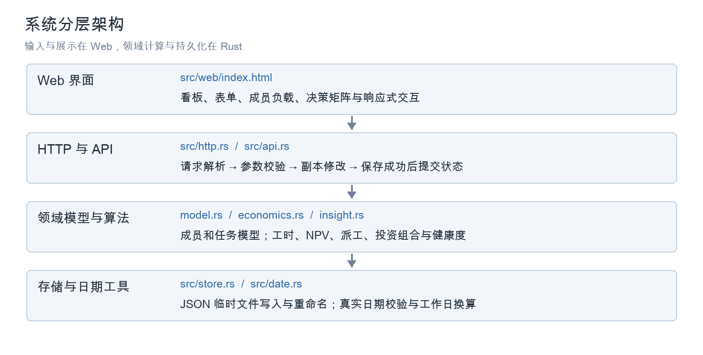

### 4.2 模块职责

| 文件 | 职责 |
| --- | --- |
| src/model.rs | 成员、任务、角色、优先级、状态与经济字段 |
| src/economics.rs | 有效工时、投入、NPV、WSJF、决策矩阵与组合 |
| src/insight.rs | 负载、派工、预警和健康度 |
| src/store.rs | 内存数据、JSON 持久化、损坏保护与编号修复 |
| src/api.rs / http.rs | 路由、输入校验、写事务和轻量 HTTP 服务 |
| src/date.rs | 真实日期校验与跳过周末的工作日换算 |
| src/web/index.html | 浅色单页界面、拖拽、表单、决策弹窗与移动端操作 |

### 4.3 领域模型设计

成员提供产能和成本条件；任务同时携带工时、截止日、收益与延期日损失。一个成员可以承担多个任务，任务也可以暂不分配负责人。删除成员不会删除任务。

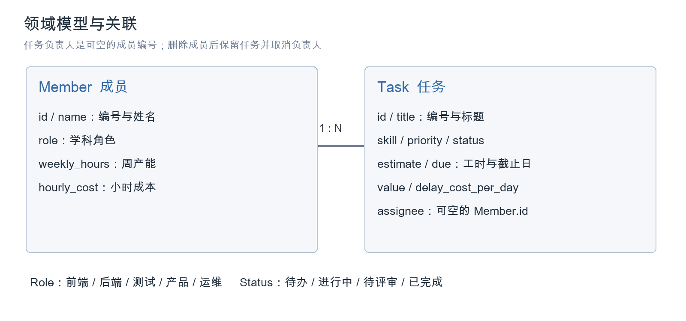

## 5 工程管理层实现

### 5.1 任务看板

本次演示包含 13 项任务：待办 10 项，其余三个状态各 1 项。图 5-1 展示基准工时；已完成任务仍展示在看板中，但不进入未完成任务负载。

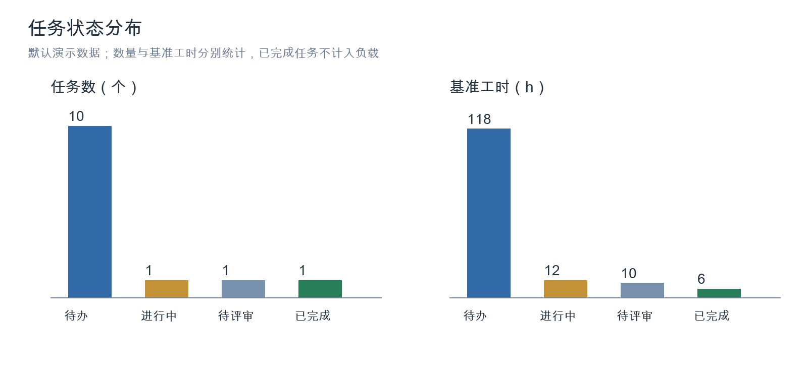

### 5.2 资源负载

负载使用有效工时，即基准工时乘学科系数，再在跨学科时加 2h 沟通。超过 85% 提示吃紧，超过 100% 提示过载。自动派工不会撤销原有指派，因此派工后仍需人工处理存量过载。

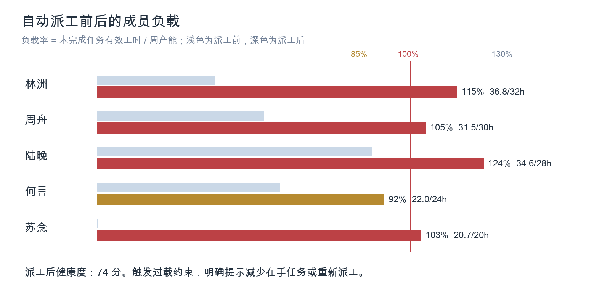

派工后已分配有效工时为 145.6h，加上未派工文档任务最低 20h，总需求 165.6h；团队周产能为 134h，缺口 31.6h，按平均每人 26.8h 折算约 1.2 人周。

### 5.3 风险预警

派工后接口返回 12 条预警。风险文字根据适用场景附延期损失、工时或投入估算；并非每一种预警都含金额。

| 风险类型 | 判定或计量口径 |
| --- | --- |
| 逾期 | 截止日早于采集日；自然日逾期天数 × 延期日损失 |
| 临期未开工 | 距截止日不超过 3 天且状态仍为待办 |
| 成员过载 | 有效工时 / 周产能 > 100%；超出工时按 1.5 倍时薪估算 |
| 产能缺口 | 未完成任务需求超过团队总周产能 |
| 跨学科承接 | 展示相对同工时基准增加的人力成本 |
| 其他 | P0 未派工、尚未估值、净现值倒挂及有待派工需求时的闲置 |

### 5.4 团队健康度

基础分由未逾期比例、负载均衡和派工覆盖率加权计算。均衡度为 1 减负载率标准差，限制在 0 到 1。这里的未逾期比例不是历史准时交付率。

H₀ = round[100 × (0.40T + 0.35B + 0.25C)]

修复后增加风险约束：任一成员负载超过 100%，综合分最高为 74；超过 130%，最高为 59，并给出对应过载建议。这样可避免所有人一起过载仍被评价为“节奏稳健”。

| 本次分项 | 数值 |
| --- | --- |
| 未逾期比例 T | 11 / 12 = 91.67% |
| 负载均衡 B | 89.16% |
| 派工覆盖 C | 11 / 12 = 91.67% |
| 基础分与约束后分数 | 基础分 91；存在成员过载，最终为 74 |
| 管理建议 | 存在成员过载，需减少在手任务或重新派工 |

权重和分数上限均为管理假设。健康度用于提醒和比较，不能证明排期没有风险；长期应用应结合历史交付记录与团队反馈校准。

## 6 经济决策层实现

### 6.1 多学科成本模型

跨学科承接用固定工时系数表达学习、协作与沟通代价。系数定义于 discipline_factor；它们是课程演示参数，未通过企业历史数据拟合。图 6-1 完整列出五类角色之间的系数，包括测试与运维的 1.50。

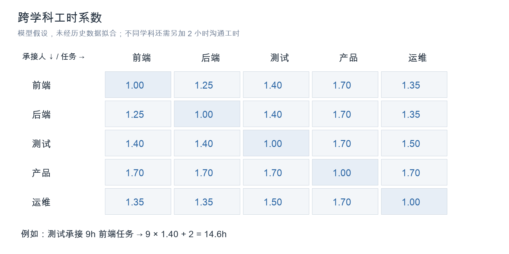

有效工时 = 基准工时 × 学科系数 + 跨学科沟通工时

同学科沟通附加为 0h，跨学科为 2h。例如陆晚以测试角色承接 9h 的前端任务，投入工时为 9 × 1.40 + 2 = 14.6h；再加两项各 10h 的本学科任务，合计 34.6h，占 28h 周产能的 123.57%。

| 参数 | 取值与含义 |
| --- | --- |
| 时薪 | 演示输入；用于估算人力投入 |
| 贴现率 | 年化 12%，日率用 12% / 365 近似 |
| 默认延期日损失 | 收益 × 2% × 权重；P0/P1/P2 权重为 1.5/1/0.5 |
| 覆盖规则 | 任务可以显式提供延期日损失；填 0 表示无损失 |

### 6.2 净现值模型

模型将收益简化为在交付日一次实现，再减去延期损失和投入成本。预计完成日先把队列工时换算成工作日，并跳过周末；延期与贴现使用自然日。目前未处理法定节假日和分期现金流。

NPV = PV − 延期损失 − 总投入

收益现值 PV = 预期收益除以 (1 + 0.12 / 365) 的等待自然日天数次幂。ROI = NPV / 总投入。“损失等值天数” = 总投入 / 延期日损失；分母为零时返回空值，它不代表现金流投资回收期。

| 消息推送重复投递修复 | 何言方案的复算过程 |
| --- | --- |
| 采集日 / 截止日 | 2026-09-05 / 2026-09-06 |
| 排队工时 / 本任务工时 | 14h / 8h；每日容量 = 24 / 5 = 4.8h |
| 完成日期 | 向上取整 22 / 4.8 = 5 个工作日，完成日为 2026-09-11 |
| 收益现值 | 32,000 / (1 + 0.12 / 365) 的 6 次幂 = 31,936.95 元 |
| 延期损失 | 5 天 × 960 元/天 = 4,800 元 |
| 总投入 | 8h × 380 元/h = 3,040 元；未新增加班溢价 |
| 净现值 | 31,936.95 − 4,800 − 3,040 = 24,096.95 元 |

### 6.3 边际成本与产能约束

超过周产能的工时追加 50% 溢价，超过 120% 的部分再追加 150%。新增任务只承担“接单后累计溢价减接单前累计溢价”，避免把已排队任务的溢价重复计入新方案。候选方案接单后负载超过 130% 时判为不可行。

### 6.4 WSJF 排序

WSJF = 延期日损失 / max(基准工时, 0.5)。自动派工按该值降序处理未派工任务；默认延期日损失仍受 P0/P1/P2 影响，因此并未完全取代优先级。未估值、净现值不为正或没有产能可行方案的任务保留为未派工。

### 6.5 决策矩阵

决策矩阵为同一任务比较所有成员方案，先区分可行性，再按净现值排序。本次“消息推送重复投递修复”中，何言是唯一的产能可行方案；其他成员在承接该任务后会超过 130% 上限。

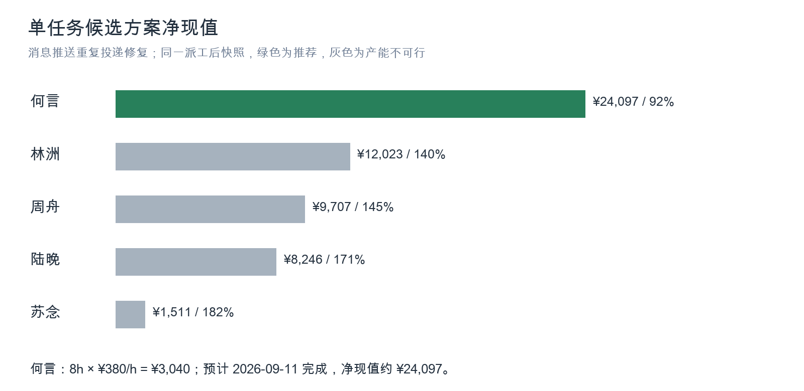

| 成员 | 总投入 | 预计完成 | 负载 | NPV |
| --- | --- | --- | --- | --- |
| 何言 | ¥3,040 | 2026-09-11 | 92% | ¥24,097 |
| 林洲 | ¥11,232 | 2026-09-15 | 140% | ¥12,023 |
| 周舟 | ¥12,578 | 2026-09-16 | 145% | ¥9,707 |
| 陆晚 | ¥13,068 | 2026-09-17 | 171% | ¥8,246 |
| 苏念 | ¥18,832 | 2026-09-18 | 182% | ¥1,511 |

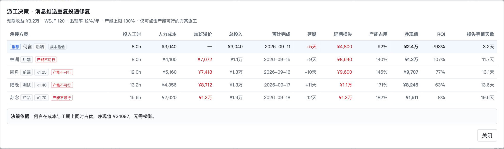

表中的不可行方案用于比较代价，不代表系统建议采用。推荐只在当前数据与模型约束内成立，不保证现实中的收益一定兑现。

### 6.6 投资组合

以团队周产能作为预算，按单位工时净现值贪心选择。计算过程累计成员负载并重新估算成本；已派工任务沿用负责人，不自动重分配存量任务。未纳入任务可能因产能不足、无可行承接人或净现值不为正而暂缓。

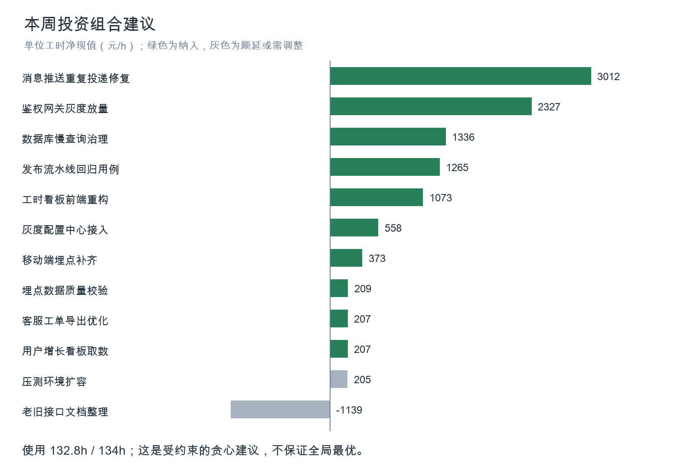

| 指标 | 本次结果 |
| --- | --- |
| 产能使用 | 132.8h / 134h |
| 组合投入 / 组合净现值 | ¥63,168 / ¥123,484 |
| 组合 ROI | 195.5% |
| 暂缓任务数 / 延期损失估算 | 2 项 / ¥1,200 |

这是启发式建议，未求解全局最优，也未完整建模任务依赖。暂缓损失按延期日损失乘 5 估算；组合与在手总览采用不同选择范围，不能把二者金额混为同一预算。

## 7 交互界面实现

当前界面为浅色主题。左侧管理成员和负载，中间为四列看板，右侧展示经济决策与风险。顶栏显示健康度、投入、收益、净现值与 ROI。截图截取 1920 × 1080 视口，超出视口的任务继续向下滚动查看。

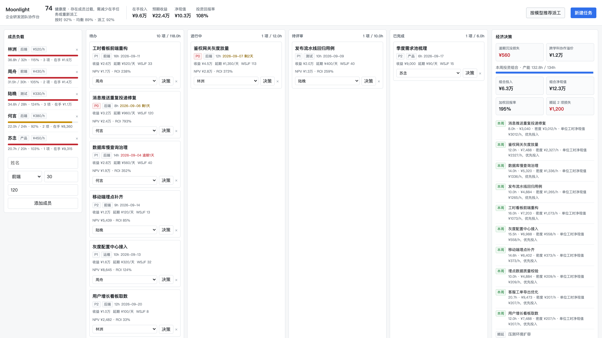

| 在手经济总览 | 值 |
| --- | --- |
| 投入 | ¥95,845 |
| 预期收益 | ¥224,000 |
| 净现值 | ¥103,325 |
| ROI | 107.8% |
| 沉没延期损失 / 跨学科溢价 | ¥560 / ¥12,338 |

以上为 2026-09-05 默认数据执行一次自动派工后的快照。总览按任务在当前队列下分别估算，属于情景分析汇总，不是企业实际结算成本；收益数值由演示数据给定。

### 7.1 表单与移动端交互

新建任务表单收集学科、优先级、工时、截止日期、收益和负责人。窄屏下看板改为单列，每张卡片提供状态下拉框。验收以 390 × 844 视口修改任务状态，并通过接口确认保存生效。

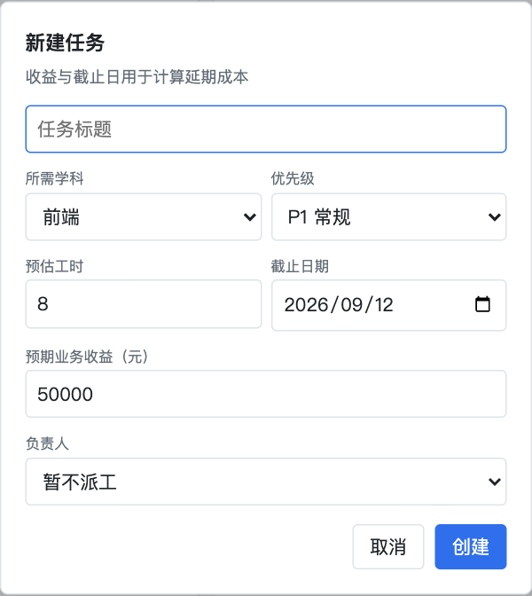
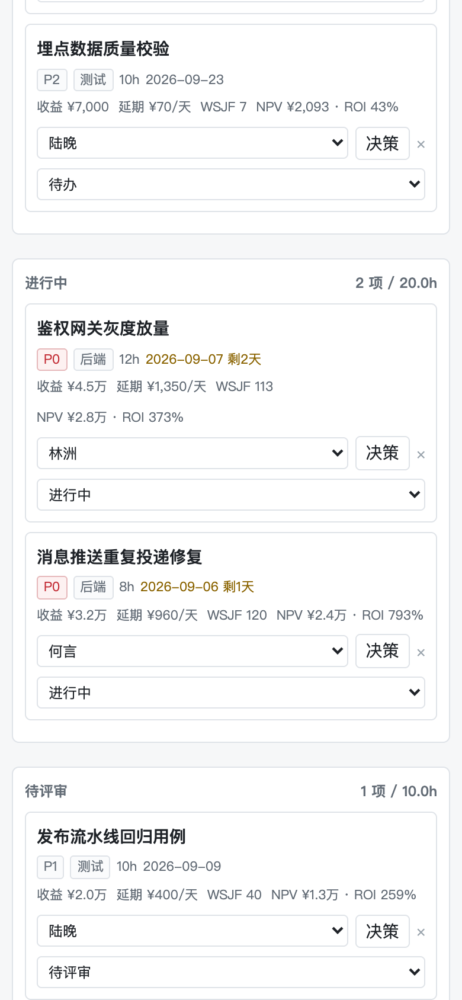

桌面端已验证从卡片标题拖拽到“进行中”列，状态更新后通过 API 复核；移动端使用下拉框完成同一类操作。决策弹窗只允许选择产能可行行，表格较宽时在内部横向滚动。

桌面和移动端验收结束后均恢复隔离演示数据的任务状态，统计图继续使用派工后的统一快照。

## 8 测试与验收

### 8.1 代码质量与构建

在本次 macOS / arm64 环境依次执行格式检查、静态分析、测试和 Release 构建，均正常退出。完整输出保存在 checks.txt 与 checks.json。

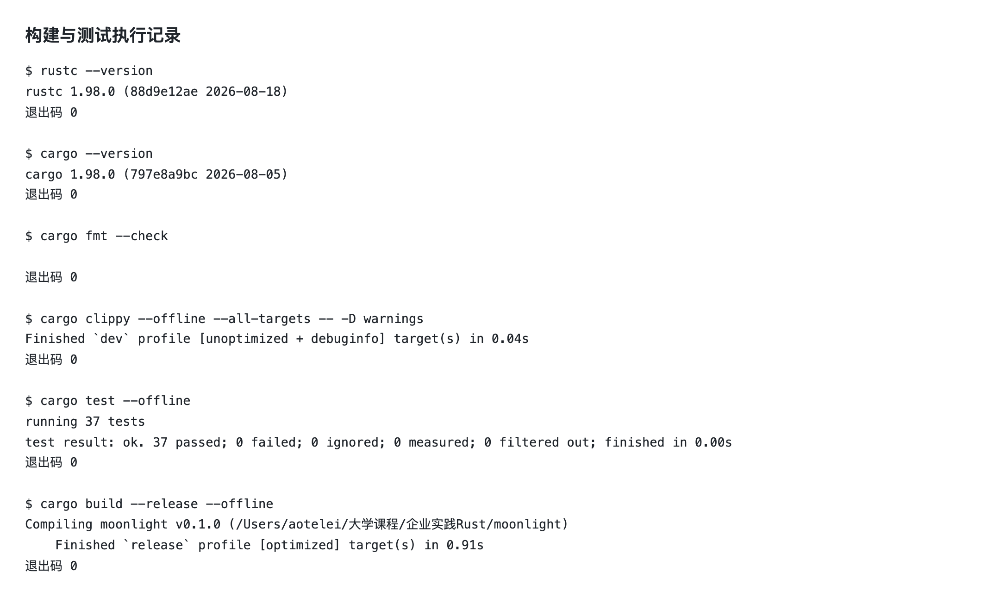

### 8.2 自动化测试

本次共 37 项测试通过。新增与本报告问题对应的回归项包括：均匀过载不能获得健康评价、未估值和负净现值任务不自动分配、工作日交付跳过周末；同时保留落盘失败回滚、边际加班溢价、组合累计成员负载、显式零延期损失等测试。

测试通过说明已覆盖场景符合断言，不代表完成企业级安全审计或所有输入组合验证。Release 二进制为当前平台产物，文件大小与编译目标和工具链相关。

### 8.3 API 联调与异常输入

GET /api/state 返回成员、任务、负载、预警、健康度和经济总览；GET /api/tasks/4/decision 返回决策矩阵；POST /api/auto-assign 完成自动派工。

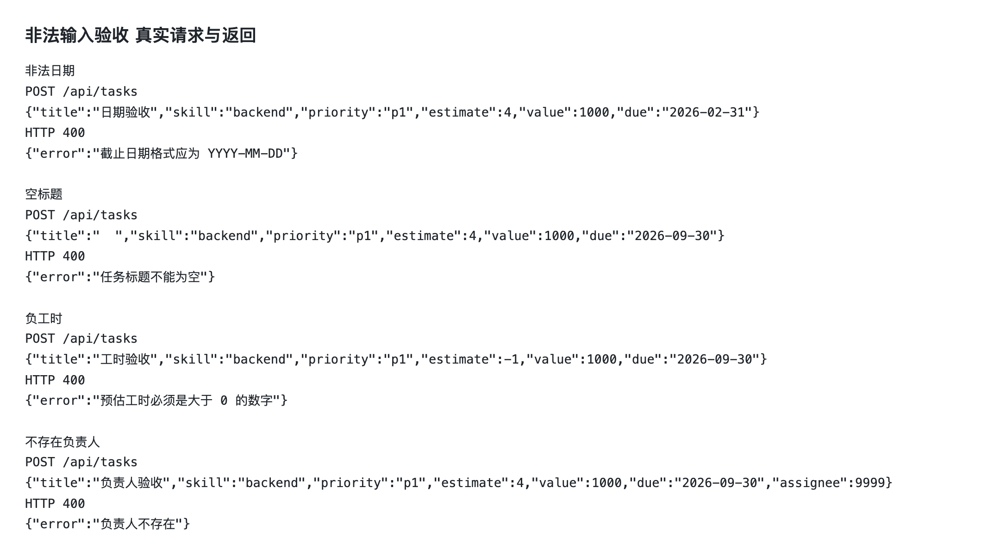

| 验收项 | 实际结果 |
| --- | --- |
| 空标题、负工时、非法日期、不存在负责人 | 四项均返回 HTTP 400，未增加任务 |
| 桌面拖拽 | 任务状态写入服务端并复核通过 |
| 移动端操作 | 状态下拉框可用，未出现页面横向溢出 |
| 页面脚本 | 未捕获到 pageerror |
| 数据隔离 | 启动时指定临时数据路径，未使用现有团队数据 |

持久化失败场景由自动化测试模拟不可写路径：接口返回 500，原内存状态不变；恢复目录后再次写入成功。该场景不在真实团队数据目录上执行。

## 9 小组分工与协作

### 9.1 成员与职责

| 成员 | 项目分工 | 对应模块 |
| --- | --- | --- |
| 陈杰 | 领域模型、经济算法、存储 | model.rs / economics.rs / store.rs |
| 郭景星 | 前端与交互 | src/web/index.html |
| 单婷婷 | 测试与质量验证 | 各模块测试、接口与交互验收 |
| 张轩玉 | 需求与文档 | README.md / 课程实践报告 |

分工描述对应小组协作职责；下列源码节选用于说明工程产物。具体个人提交范围应结合仓库账号和提交记录确认，不能仅由文件截图推断作者。

### 9.2 Rust 核心产物

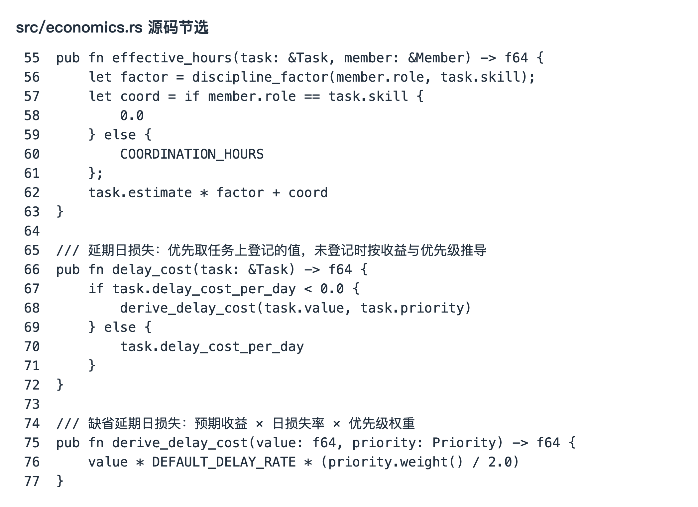

### 9.3 前端与测试产物

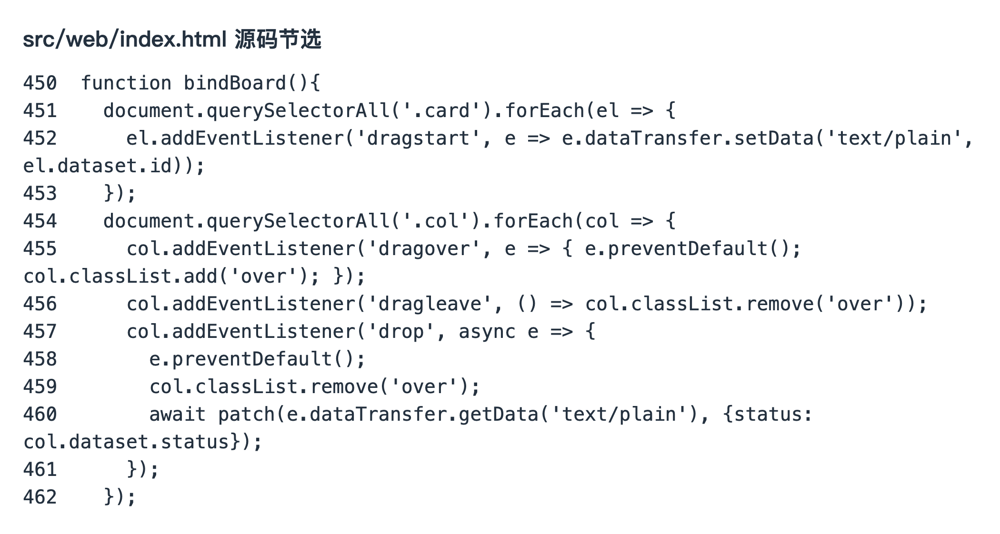

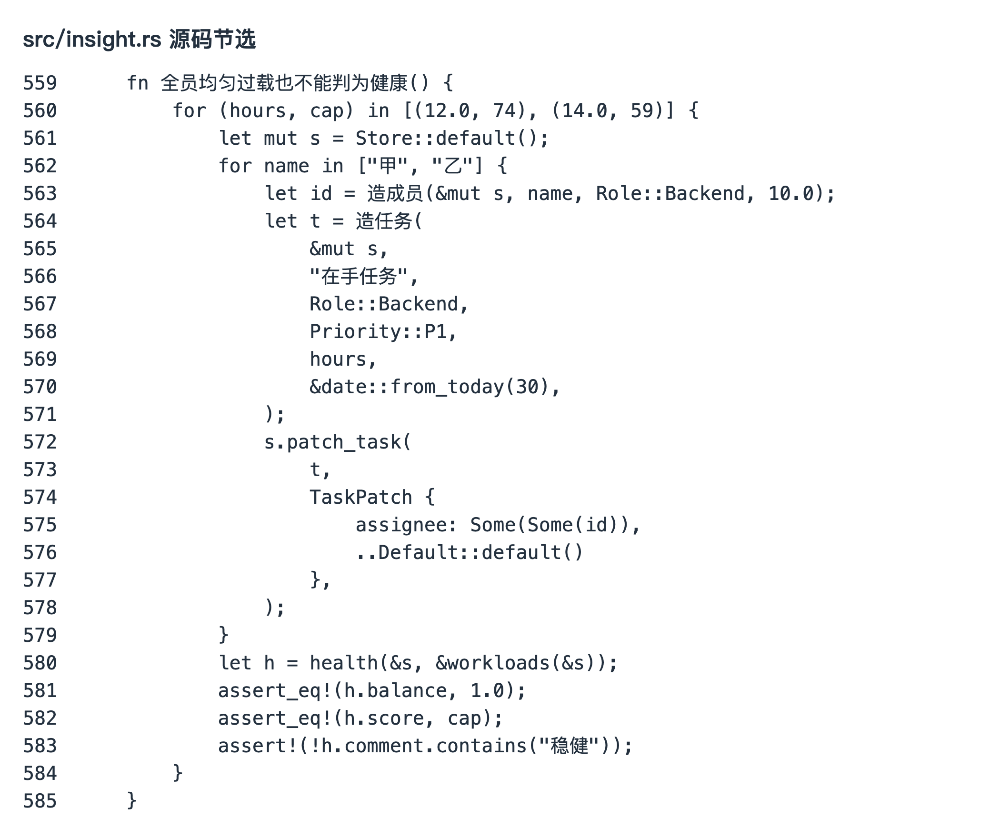

图 9-2 对应真实交互绑定，图 9-3 对应新增回归断言；测试执行是否通过以第 8 章命令日志为准。

### 9.4 文档与可追溯记录

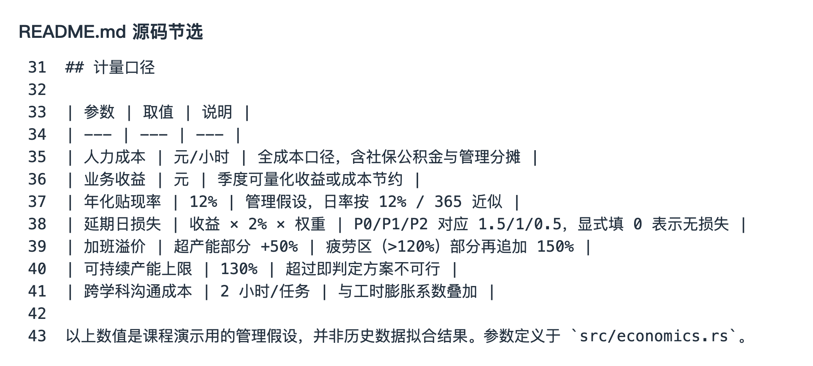

Git 历史包含功能实现、经济决策更新、合并评审和界面风格调整。以下为本地仓库可核验记录，账号与小组真实姓名不作自动映射。

| 提交或记录 | 账号与内容 |
| --- | --- |
| a8430cc | Kiyra：研发团队协作台初始实现 |
| e8ba960 | Apson-Chian：完善课程要求与经济决策支持 |
| dee24f2 | Kiyra：增加经济决策层 |
| PR #1 / 55181b9 | 原仓库已合并的课程与经济决策更新 |
| d305a30 | Kiyra：界面改为浅色 |
| e31c812 | 本次模型边界、持久化与验收口径修复 |

原 PR： https://github.com/Kiyra-gjx/moonlight/pull/1

协作采用分工实现、代码提交、质量检查和集成验收。后续以实际发生的提交、评审和会议记录补充协作过程，不用代码截图代替个人贡献证明。

## 10 局限与后续计划

当前版本定位为课程实践 MVP。JSON 存储适合单实例本地运行，不支持多实例并发写入；尚未实现身份认证、细粒度授权和操作审计。若扩展到生产环境，应补充数据库、访问控制、备份恢复与并发测试。

经济参数属于管理假设，收益和工时由用户估计。当前收益按交付日一次实现，未处理分期现金流；工作日只排除周末，不含节假日；未完整建模任务依赖、历史完成情况和工作剩余量。后续应利用真实工时与交付记录校准。

健康度已增加过载上限，但其权重和分数阈值仍需验证。投资组合采用贪心选择，不保证全局最优；在手总览是独立情景估算汇总，不能直接当作会计结算或完整项目预算。

## 11 结论

本项目以 Rust 实现领域模型、存储、HTTP 服务和主要决策逻辑，通过内嵌 Web 页面提供任务管理与可视化交互，满足课程关于核心语言和交互界面的要求。

本次统一了源码、演示数据、图表和验收日志，补充完整学科系数、NPV 算例、领域关系图与交互验证，修复保存失败一致性、加班成本边界、过载健康度和派工估值判断。37 项自动化测试及桌面、移动端、异常输入验收通过，形成可运行、可解释、可复核的课程交付。

### 复核材料

| 材料 | 仓库位置 |
| --- | --- |
| 代码版本与哈希 | e31c812；evidence/2026-09-05/source-sha256.txt |
| 派工前后数据 | state-before.json / state-after.json |
| 候选方案与保存数据 | decision.json / demo-after.json |
| 命令执行结果 | checks.txt / checks.json |
| API 与交互验证 | api-tests.json / ui-tests.json |
| 图表与截图 | docs/evidence/2026-09-05/*.png |

复现时使用新的临时数据文件启动服务，先保存初始快照，再执行一次自动派工。跨日期运行会改变延期与净现值，应以新的采集日期和结果更新报告。
